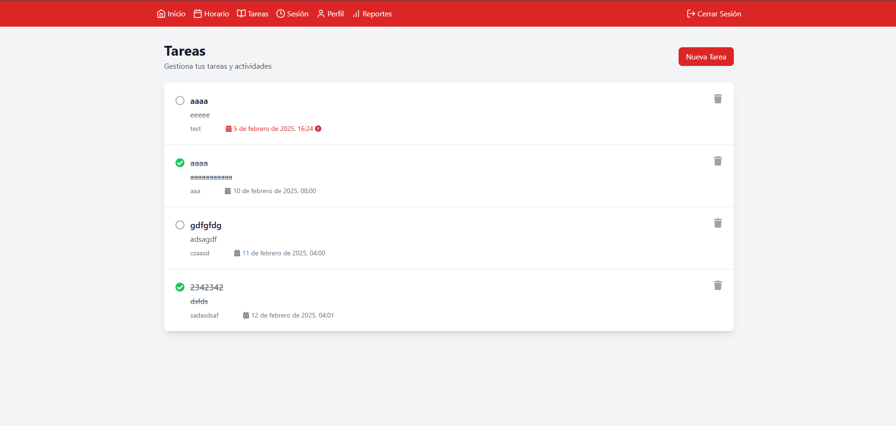

# 📚 FESC Student Agenda

<div align="center">


[](https://www.typescriptlang.org/)
[](https://reactjs.org/)
[](https://nodejs.org/)
[](https://www.mongodb.com/)
[](https://www.docker.com/)
[](https://huggingface.co/deepseek-ai)

Una aplicación web moderna para ayudar a los estudiantes de la FESC a organizar sus actividades académicas y recibir recomendaciones personalizadas de recursos educativos utilizando IA avanzada.

[Ver Demo](https://fescagenda.eas1.com.es) | [Reportar Bug](https://github.com/DavidCreat/fesc-student-agenda/issues) | [Solicitar Feature](https://github.com/DavidCreat/fesc-student-agenda/issues)

</div>

## 📑 Tabla de Contenidos
- [Características](#-características)
- [Tecnologías](#-tecnologías-utilizadas)
- [Arquitectura](#-arquitectura-del-sistema)
- [Base de Datos](#-estructura-de-base-de-datos)
- [Instalación](#️-instalación)
- [Despliegue](#-despliegue-con-docker)
- [API Endpoints](#-api-endpoints)
- [Contribuir](#-contribuir)
- [Licencia](#-licencia)

## 🌟 Características

- 📅 **Gestión de Horarios**
  - Organización de clases y actividades académicas
  - Recordatorios y notificaciones
  - Vista semanal y mensual del calendario
  - Exportación a PDF del horario

- 📝 **Seguimiento de Tareas**
  - Creación y gestión de tareas
  - Priorización y fechas límite
  - Estado de progreso
  - Filtros y búsqueda avanzada

- 📚 **Recomendaciones con IA**
  - Modelo DeepSeek-R1 para recomendaciones precisas
  - Sugerencias de libros basadas en tu carrera y semestre
  - Videos educativos relevantes
  - Recursos de aprendizaje personalizados
  - Análisis de patrones de estudio

- 📊 **Dashboard y Reportes**
  - Visualización de progreso académico
  - Estadísticas de uso
  - Reportes personalizados en PDF
  - Histórico de actividades

## 💾 Estructura de Base de Datos

### MongoDB Atlas Configuration

```javascript
const dbConfig = {
  cluster: "clusterProyectos",
  database: "fesc_agenda",
  collections: {
    scheduleEntries: {
      indexes: ["userId", "date"],
      schema: {
        userId: "ObjectId",
        title: "String",
        date: "Date",
        startTime: "String",
        endTime: "String",
        description: "String",
        type: "String",
        location: "String"
      }
    },
    tasks: {
      indexes: ["userId", "dueDate"],
      schema: {
        userId: "ObjectId",
        title: "String",
        description: "String",
        dueDate: "Date",
        priority: "String",
        status: "String",
        category: "String"
      }
    },
    users: {
      indexes: ["email", "studentId"],
      schema: {
        email: "String",
        password: "String",
        name: "String",
        career: "String",
        semester: "Number",
        studentId: "String",
        preferences: "Object"
      }
    },
    sessionLogs: {
      indexes: ["userId", "timestamp"],
      schema: {
        userId: "ObjectId",
        action: "String",
        timestamp: "Date",
        details: "Object"
      }
    }
  }
};
```

## 🔌 API Endpoints

### Autenticación
```typescript
POST /api/auth/login
POST /api/auth/register
POST /api/auth/logout
GET  /api/auth/verify
```

### Horarios
```typescript
GET    /api/schedule
POST   /api/schedule
PUT    /api/schedule/:id
DELETE /api/schedule/:id
GET    /api/schedule/export/pdf
```

### Tareas
```typescript
GET    /api/tasks
POST   /api/tasks
PUT    /api/tasks/:id
DELETE /api/tasks/:id
PATCH  /api/tasks/:id/status
```

### Recomendaciones
```typescript
POST   /api/recommendations/generate
GET    /api/recommendations/history
POST   /api/recommendations/feedback
```

## 🔧 Variables de Entorno

```bash
# Server Configuration
VITE_PORT=5000
VITE_FRONTEND_URL=https://fescagenda.eas1.com.es

# MongoDB Configuration
VITE_MONGODB_URI=mongodb+srv://<username>:<password>@clusterproyectos.nothu.mongodb.net/
VITE_MONGODB_DB_NAME=fesc_agenda

# JWT Configuration
VITE_JWT_SECRET=<your-secret-key>
VITE_JWT_EXPIRE=24h

# HuggingFace Configuration
VITE_HUGGINGFACE_TOKEN=<your-token>
VITE_HUGGINGFACE_API_URL=https://api-inference.huggingface.co/models/deepseek-ai/DeepSeek-R1
```

## 📦 Scripts Disponibles

```bash
# Desarrollo
npm run dev           # Inicia frontend y backend en modo desarrollo
npm run client:dev    # Inicia solo el frontend
npm run server:dev    # Inicia solo el backend

# Producción
npm run build        # Construye frontend y backend
npm run start        # Inicia la aplicación en producción

# Utilidades
npm run lint         # Ejecuta el linter
npm run format       # Formatea el código
npm run typecheck    # Verifica tipos de TypeScript
```

## 🚀 Tecnologías Utilizadas

### Frontend
- React 18 con TypeScript
- Zustand para gestión de estado
- React Query para manejo de datos
- Framer Motion para animaciones
- Recharts para visualizaciones
- React Hook Form para formularios

### Backend
- Node.js con Express
- MongoDB con Mongoose
- JWT para autenticación
- API de Hugging Face para IA (CON EL NUEVO MODELO DE DeepSeek)
- TypeScript para tipo seguro

### DevOps
- Docker y Docker Compose
- Despliegue automatizado
- Monitoreo y logs

## 📋 Prerrequisitos

- Node.js 18 o superior
- MongoDB
- Docker y Docker Compose (para despliegue)
- Variables de entorno configuradas

## 🛠️ Instalación

1. **Clonar el repositorio**
   ```bash
   git clone https://github.com/DavidCreat/fesc-student-agenda.git
   cd fesc-student-agenda
   ```

2. **Instalar dependencias**
   ```bash
   npm install
   ```

3. **Configurar variables de entorno**
   ```bash
   cp .env.example .env
   # Editar .env con tus configuraciones
   ```

4. **Iniciar en modo desarrollo**
   ```bash
   npm run dev
   ```

## 🐳 Despliegue con Docker

1. **Construir la imagen**
   ```bash
   docker-compose build
   ```

2. **Iniciar los servicios**
   ```bash
   docker-compose up -d
   ```

3. **Verificar el estado**
   ```bash
   docker-compose ps
   ```

## 📊 Arquitectura del Sistema


## 📸 Capturas de Pantalla

<div align="center">

### 🏠 Dashboard y Calendario


### ✅ Tareas y Recomendaciones



### 👤 Perfil y Sesión


### 📊 Reportes y Análisis


</div>

## 🤝 Contribuir

Las contribuciones son bienvenidas. Por favor, lee [CONTRIBUTING.md](CONTRIBUTING.md) para detalles sobre nuestro código de conducta y el proceso para enviarnos pull requests.

1. Fork el proyecto
2. Crea tu Feature Branch (`git checkout -b feature/AmazingFeature`)
3. Commit tus cambios (`git commit -m 'Add some AmazingFeature'`)
4. Push a la Branch (`git push origin feature/AmazingFeature`)
5. Abre un Pull Request

## 📝 Licencia

Este proyecto está bajo la Licencia MIT - ver el archivo [LICENSE.md](LICENSE.md) para detalles.

## 👥 Autores

- **David Fonseca** - *Desarrollo Full Stack* - [@davidfonseca12p](https://github.com/davidfonseca12p)

## 🙏 Agradecimientos

- FESC por el apoyo institucional
- Todos los estudiantes que participaron en las pruebas
- La comunidad open source por las herramientas utilizadas

---

<div align="center">
Desarrollado con ❤️ para la comunidad FESC
</div>
